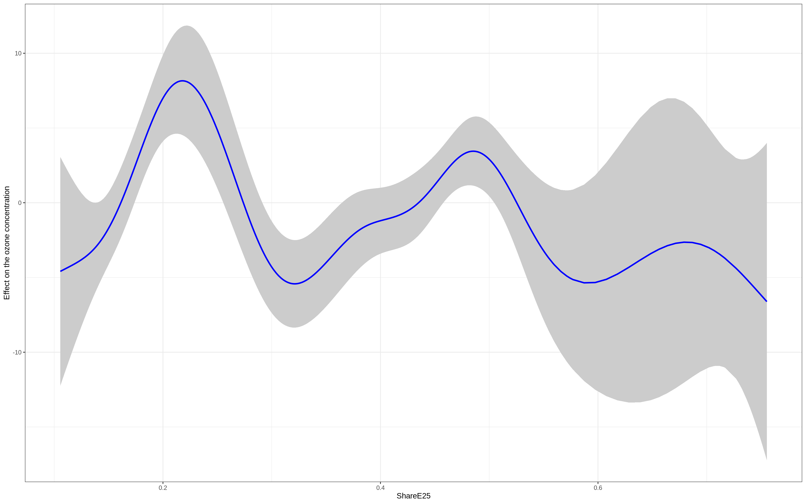
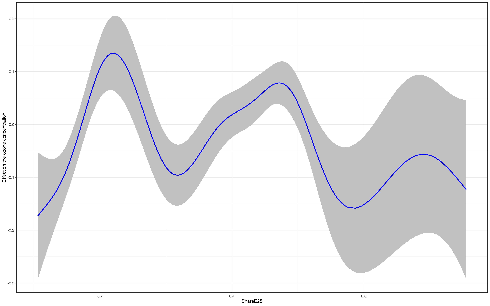
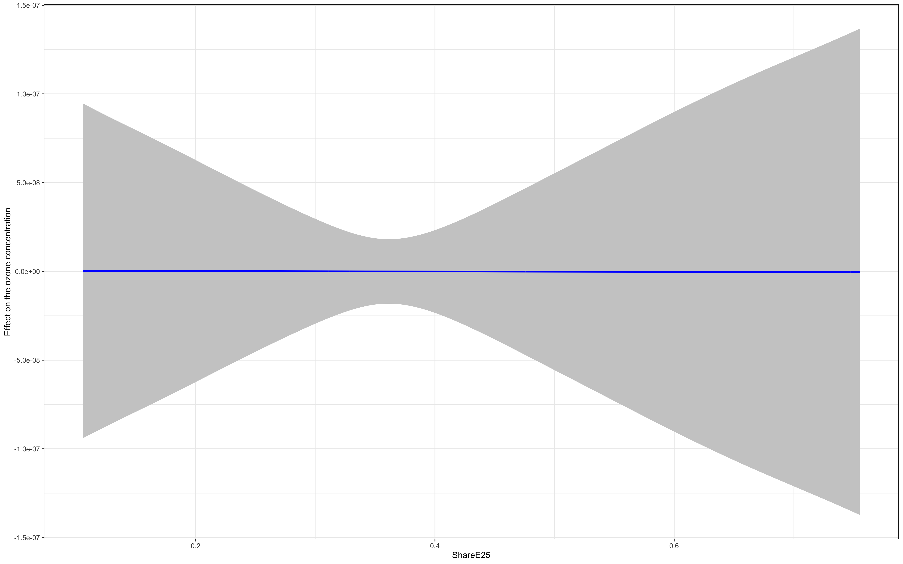
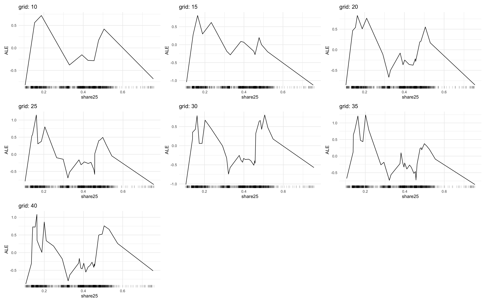
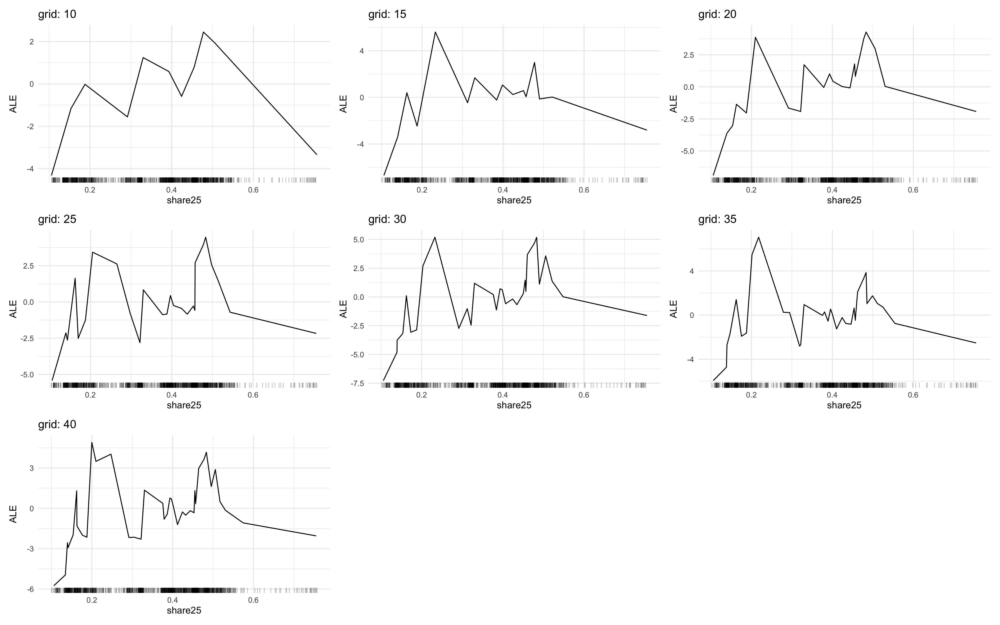

```{r setup, include=FALSE}
knitr::opts_chunk$set(echo = FALSE)

library(tidyverse)
library(iml)

source("../utils/utils_eda.R")

theme_set(theme_minimal())
```

# Comparação das métricas

```{r}
results <- list.files(
  "../../results/dom_pedro_ii/", 
  pattern = "metrics.rds",
  full.names = TRUE
)

tab_metrics <- map_dfr(
  results,
  ~ read_rds(.x) %>% 
    mutate(
      model = str_remove(.x, ".*//"),
      model = str_remove(model, "_metrics.rds")
    ) %>% 
    select(model, everything())
)
```

### RMSE

```{r}
estimates_plot(tab_metrics, "rmse")
```

### MAE

```{r}
estimates_plot(tab_metrics, "mae")
```


### R2

```{r}
estimates_plot(tab_metrics, "rsq", rev = FALSE)
```

# Resultados dos modelos

### Regressão linear

Estimativas

```{r}
read_rds("../../results/dom_pedro_ii/linear_regression_estimates.rds") %>% 
  estimates_table()
```

### Polynimial regression

#### Degree 2

```{r}
read_rds("../../results/dom_pedro_ii/poly_regression_degree2_estimates.rds") %>%
  estimates_table()
```

#### Degree 3

```{r}
read_rds("../../results/dom_pedro_ii/poly_regression_degree3_estimates.rds") %>%
  estimates_table()
```

### GAM

```{r}
link_gaussian <- tab_metrics %>% 
  filter(model == "gam_gaussian") %>% 
  pull(link_function) %>% 
  unique

link_gamma <- tab_metrics %>% 
  filter(model == "gam_gamma") %>% 
  pull(link_function) %>% 
  unique

link_inv_gaussian <- tab_metrics %>% 
  filter(model == "gam_inv_gaussian") %>% 
  pull(link_function) %>% 
  unique
```

#### Gaussian (link = `r link_gaussian`)

##### Estimates

```{r}
read_rds("../../results/dom_pedro_ii/gam_gaussian_estimates.rds") %>%
  estimates_table()
```

##### GAM plot

```{r}

```

#### Gamma (link = `r link_gamma`)

##### Estimates

```{r}
read_rds("../../results/dom_pedro_ii/gam_gamma_estimates.rds") %>%
  estimates_table()
```

##### GAM plot

```{r}

``` 
 
 
#### Inverse gaussian (link = `r link_inv_gaussian`)

```{r}
read_rds("../../results/dom_pedro_ii/gam_inv_gaussian_estimates.rds") %>%
  estimates_table()
```

##### GAM plot

```{r}

```

### Random forest

#### Hyperparameters

```{r}
# hp_table(tab_metrics, "random_forest")
```

#### ALE share

```{r, fig.cap="ALE plot"}

```

### XGBooost

#### Hyperparameters

```{r}
# hp_table(tab_metrics, "xgboost")
```

#### ALE share

```{r, fig.cap="ALE plot"}

```

