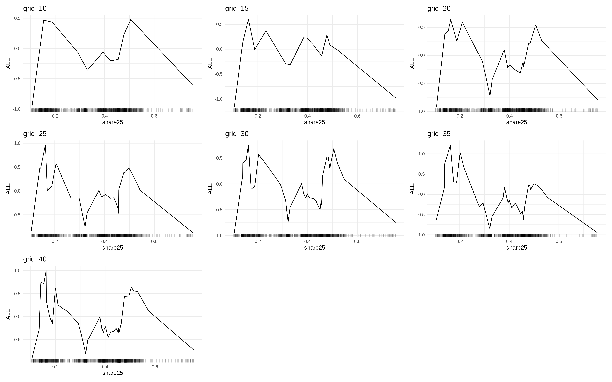
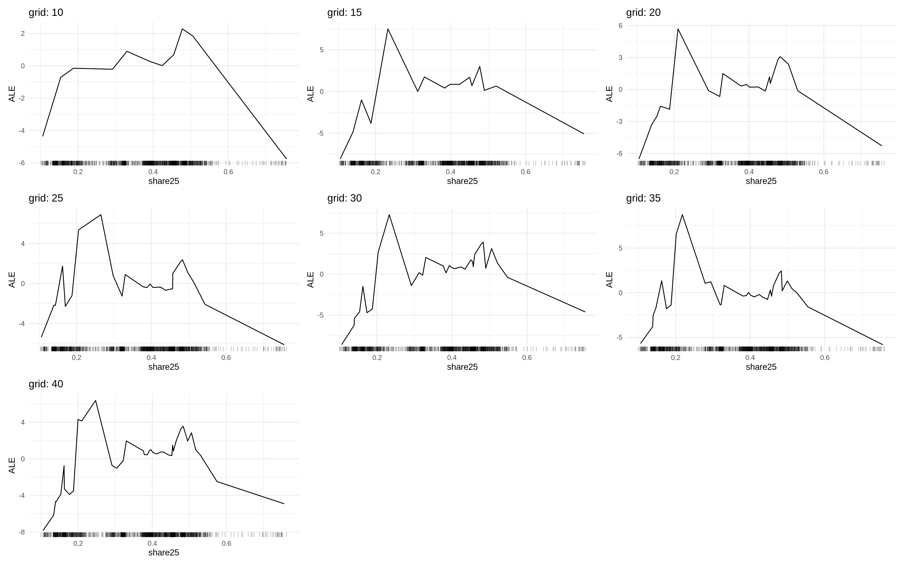

```{r setup, include=FALSE}
knitr::opts_chunk$set(echo = FALSE)

library(tidyverse)
library(iml)

source("utils.R")

theme_set(theme_minimal())
```

## Comparação das métricas

```{r}
results <- list.files(
  "../../results/dom_pedro_ii/", 
  pattern = "metrics.rds",
  full.names = TRUE
)

tab_metrics <- map_dfr(
  results,
  ~ read_rds(.x) %>% 
    mutate(
      model = str_remove(.x, ".*//"),
      model = str_remove(model, "_metrics.rds")
    ) %>% 
    select(model, everything())
)
```

##### RMSE

```{r}
estimates_plot(tab_metrics, "rmse")
```

##### MAE

```{r}
estimates_plot(tab_metrics, "mae")
```


##### R2

```{r}
estimates_plot(tab_metrics, "rsq", rev = FALSE)
```

## Resultados dos modelos

#### Regressão linear

Estimativas

```{r}
read_rds("../../results/dom_pedro_ii/linear_regression_estimates.rds") %>% 
  estimates_table()
```

#### Polynimial regression

##### Degree 2

```{r}
read_rds("../../results/dom_pedro_ii/poly_regression_degree2_estimates.rds") %>%
  estimates_table()
```

##### Degree 3

```{r}
read_rds("../../results/dom_pedro_ii/poly_regression_degree3_estimates.rds") %>%
  estimates_table()
```

#### GAM

##### Gaussian

##### Gamma

##### Inverse gaussian

#### Random forest

```{r}
hp_table(metricas, "random_forest")
```

```{r, fig.cap="ALE plot"}

```

#### XGBooost

```{r}
hp_table(metricas, "xgboost")
```


```{r, fig.cap="ALE plot"}

```

